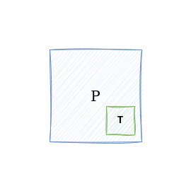
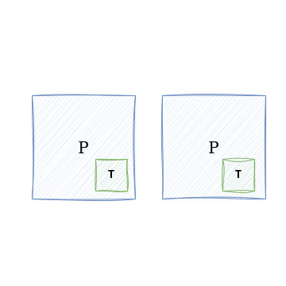
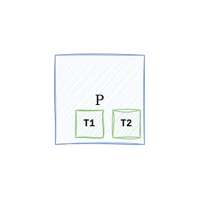

+++
title = "Асинхронный PHP"
date = 2024-03-05
draft = true

[taxonomies]
tags = ["PHP", "ASYNC"]
+++

Наиболее широко распространено неверное мнение, что PHP никак не может быть языком с поддержкой асинхронности, а все, что успели придумать к этому моменту, включая файберы, — не более чем попытки добавить в язык свойства, не характерные ему от природы.

Однако это мнение — являясь, впрочем, достаточно популярным, чтобы настойчиво подавлять границы применимости языка — на самом деле основано на заблуждениях, связанных с асинхронностью, масштаб которой, как многим ошибочно кажется, они полностью понимают.

В то же время асинхронность насчитывает столько разных форм, проявляемых с помощью платформы, например операционной системы, во взаимодействии разных приложений посредством очередей, инструментами самого языка через `event loop`, `корутины`, `цветные функции` и `неблокирующие сокеты`, что создается напряженная необходимость навести порядок, лишающий эту тему запутанных противоречий.

Чтобы в этом разобраться, однако, не хватит обсудить только асинхронность как таковую, необходимо также уделить время терминам и явлениям, с которыми ее часто путают, — параллелизму и многопоточности.

И хотя асинхронность можно выразить через многопоточность, а чаще еще и совмещать с нею, это не самая эффективная форма ее выражения. Тем более ее невозможно воспроизвести в PHP, а значит, возникает необходимость отделить асинхронность от остальных явлений доступным для понимания образом.

Но прежде чем мы дойдем до явления, вынесенного в заглавие этой статьи, мы начнем снизу — с процессов. Процесс (`P`) — а его я изобразил ниже — это запущенное приложение, которым в нашем случае могут быть либо `php-fpm`, либо `php-cli`.


Каждый процесс, как правило, состоит из одного потока (`T`). Как правило — потому что зависит от операционной системы, но мы будем говорить про `unix` системы.



Уже на данном этапе можно робко предположить, что многопроцессные приложения одного вида (например, несколько процессов `php-cli`) — это приложения, использующие множество потоков, или многопоточные приложения. Это и правда, и нет. Неправда потому, что каждый процесс населяет свое адресное пространство, которое разделяют между собой потоки, запущенные им, но разные потоки разных процессов не имеют доступа к памяти друг друга. А правда потому, что так или иначе мы продолжаем утилизировать разные ядра нашего процессора, что в целом делает наше приложение готовым к перспективе масштабирования, хоть и за счет увеличения числа процессов. 

Но что совершенно точно можно сказать, так это то, что на данном этапе, пока наше приложение запущенно в виде одного процесса, оно является однопоточным и не параллельным. Но для ответа на вопрос, является ли оно асинхронным, необходимо пойти дальше. 

Запустив два процесса, мы сделали наше приложение `многопроцессным`, и, как уже было сказано выше, даже многопоточным. 

<div style="max-width: 100vw;overflow-x: auto;">
    
</div>

И хотя наше приложение не имеет доступа к управлению — запуску и ожиданию выполнения — потоками, оно использует разные потоки (которые, вполне вероятно, запущены операционной системой на разных ядрах процессора), находясь в разных процессах. И теперь, наконец, мы сделали наше приложение еще и параллельным. Однако поскольку многие не делают разницу между параллелизмом и многопоточностью, им многопроцессный параллелизм может показаться неестественным. Тем не менее параллелизм может принимать разные формы, в том числе форму многопроцессности. И несмотря на то, что параллелизм на основе потоков в некоторых случаях эффективнее за счет того, что создание потока занимает меньше времени и памяти, чем создание процесса, многопроцессный параллелизм в то же время лишен негативных форм синхронизации доступа к памяти, которым обладают многопоточные программы.

Теперь, запустив несколько потоков в одном процессе нашей программы, мы сделали ее `многопоточной`. 



Но чтобы ответить на вопрос, является ли программа в текущем состоянии асинхронной или хотя бы параллельной, нам необходимо посмотреть код.

Примеры многопоточности я буду показывать, используя `rust`, и постараюсь их сделать как можно проще, тем более нас сейчас интересуют явления, а не конкретные задачи.

```rust
fn main() {
    let handle = std::thread::spawn(|| {
        for i in 0..=10 {
            println!("child thread: {i}");
        }
    });

    handle.join().unwrap();

    for i in 0..=10 {
        println!("parent thread: {i}");
    }
}
```

В коде выше мы запускаем поток, в котором считаем от нуля до десяти и выводим числа на экран. То же самое мы проворачиваем после того, как дождались завершения потока. И если с утверждением о том, что данная программа является многопоточной, не согласиться тяжело, то к вопросу о параллелизме надо подойти со сосредоточенной внимательностью. Обратившись к определению параллелизма, которое состоит в том, что *это свойство систем, при котором несколько вычислений выполняются одновременно*, окажется, что никакой одновременности в этой программе нет. Мы запускаем второй поток, дожидаясь в основном потоке, пока первый завершит свои вычисления, после чего проводим вычисления в основном потоке. 

И если вам кажется, что я написал такой код намеренно, чтобы подвести под свои выводы результат, то я лишь показал, что как сам код, так и синхронизация доступа к памяти с помощью мьютексов, атомарных операций и других примитивов могут сделать ваш многопоточный код последовательным, или `синхронным`.

Теперь избавимся от этого недоразумения и посмотрим на *правильный* вариант.
```rust
fn main() {
    let mut threads = Vec::new();

    for thread_id in 1..=3 {
        threads.push(std::thread::spawn(move || {
            for i in 0..10 {
                println!("child thread#{thread_id}: {i}");
                std::thread::sleep(std::time::Duration::from_millis(10));
            }
        }));
    }

    for thread in threads {
        thread.join().unwrap();
    }
}
```

Инструкции `sleep` в этом коде нужны для того, чтобы потоки успели запуститься до того, как остальные уже закончат свою работу, иначе результаты останутся такими же последовательными, хотя мы на самом деле в это время были заняты запуском потока, на который, как я упоминал выше, нужно время.

Теперь этот код по-настоящему *может* являться и параллельным, и многопоточным, хотя, повторюсь, многое зависит от условий среды, в которой он запускается, ведь может случиться так, что три этих потока будут попеременно выполняться на одном ядре процессора или что `println!` будет синхронизировать потоки при записи в буфер терминала, что в обоих случаях приведет потоки в последовательное состояние с кажущейся параллельностью. 

Как видно, граница, при которой программа из параллельной может перейти в последовательную, может быть исчезающе незаметной. В то же время асинхронность этой программы зависит от определения, к которому мы обращаемся, чтобы охарактеризовать результаты воспроизведенного явления. Если асинхронным считать код, который не блокирует текущий поток выполнения, то этот пример им будет. И действительно, `Thread Per Request` модель *асинхронности* если и уступила асинхронности на базе `мультиплексирования ввода-вывода` в популярности, тем не менее по-прежнему остается одной из самых простых в реализации и, самое главное, понимании своей работы моделью.

Но у этой модели есть ряд внушительных недостатков, связанных, во-первых, с поддержкой в языках, которой в PHP нет, а во-вторых, с производительностью, которая, как следует из устройства этой модели, зависит от мощности процессора, и поэтому на определенных объемах трафика будет деградировать, хотя, впрочем, многое зависит от того, чем потоки выполнения фактически занимаются: если большей частью они заблокированы на ожидании `IO`, то с хорошим пулом потоков ситуация может остаться удовлетворительной, потому что заблокированные потоки не занимают ядро процессора, и это время можно передать другому. 

Но поскольку такая модель, как уже было замечено, нехарактерна для PHP — хотя утверждалось, что язык поддерживает асинхронность, — необходимо обратиться к другой ее форме воспроизведения — к форме на базе `мультиплексирования ввода-вывода`, упомянутого выше. И раз классические веб-приложения, написанные на PHP, чаще всего имеют дело именно с вводом-выводом, такая асинхронность кажется невероятно положительной в вопросах увеличения производительности.

Но в отличие от асинхронности, основанной на многопоточности, эту не только реализовать, но даже понять бывает настолько трудно, что для многих ее просто не существует, а замещают ее параллелизмом, многопоточностью — одним словом, чем угодно, что проще поддается осознанию и что в результате становится основой заблуждений об однородности асинхронности как реализации. Все дело в том, что тут вступает в силу другое свойство асинхронности (первым было — способность не блокировать текущий поток выполнения), а именно — неупорядоченность, неодновременность, нелинейность, тяжело воспринимаемые неподготовленным человеческим мышлением.

Раз такая асинхронность может быть реализована только на базе задач, связанных с вводом-выводом, надо посмотреть, что в PHP есть для этого. Но для начала надо вспомнить, какие типы ввода-вывода бывают:

- работа с регулярными файлами (самые обычные файлы, куда мы, например, пишем логи); 
- потоки для ввода и вывода текста и ошибок, обычно связанных с терминалом, — `stdin`, `stdout` и `stderr`;
- сокеты;
- и некоторые другие.

*Несмотря на то, что сокеты также являются файлами, асинхронный доступ к регулярным файлам имеет плохую поддержку в unix-системах. Эту проблему среди прочих пытается решить <a href="https://unixism.net/loti/what_is_io_uring.html" target="_blank">**io-uring**</a>, но ни на нем, ни на проблемах регулярных файлах я останавливаться не буду, так как это в данном случае не требуется.*

Продолжая уже заложенный мотив статьи, следует сначала рассмотреть природу сокетов, прежде чем мы обратимся к тому, каким образом они имеют отношение к асинхронности. Сокеты — это двусторонний интерфейс обмена данными между сервером и его клиентами. Весь ваш клиентский `HTTP` трафик проходит через сокеты, используя `TCP` протокол (если мы говорим про `HTTP` не старше второй версии), который передается с помощью `IP` протокола, который, в свою очередь, передается по `Ethernet` протоколу, и так далее. То же самое происходит на стороне сервера, но в обратную сторону — от `Ethernet` к приложению, слушающему входящие соединения. Протоколы, не относящиеся к протоколам приложений, которыми могут быть, например, `HTTP` или `AMQP`, то есть такие протоколы, как `TCP` и `UDP`, как правило, реализованы самой операционной системой. 

Таким образом, чтобы отправить сообщение удаленному серверу, необходимо использовать сокеты и несколько системных вызовов для записи и чтения данных через них. В `PHP` есть несколько функций, которые нам могут помочь:
```php
<?php declare(strict_types=1);

require_once __DIR__.'/vendor/autoload.php';

\set_error_handler(static function (int $errno, string $errstr): never {
    throw new \Exception(
        sprintf('Connection error: %s (error #%d).', $errstr, $errno),
    );
});

try {
    $conn = \stream_socket_client('tcp://127.0.0.1:8099');

    \fwrite($conn, 'PING\n'); // <— BLOCKING
    \fclose($conn);
} finally {
    \restore_error_handler();
}
```

В коде выше мы подключились к серверу, используя `TCP` протокол, записали сообщение и закрыли соединение. Комментариями я отметил, на каком системном вызове этот код заблокируется. В заблокированном состоянии поток переводится операционной системой в режим ожидания и снимается с ядра процессора. Это значит, что никакой другой работы в этом случае этот поток делать не может. А поскольку весь наш процесс состоит из одного этого потока, весь процесс оказывается заблокирован. Таким образом, чтобы обслужить следующего пользователя, нам нужен новый процесс. А потом еще один. И еще один. Каждому новому процессу, кроме собственно создания, требуется настройка всех сервисов приложения, что в общем становится невероятно дорогим занятием.

Но поскольку все уровни модели OSI, начиная с транспортного, к которому относятся в том числе `TCP` и `UDP`, и ниже, как правило, реализованы самой операционной системой, появляется возможность не дожидаться на уровне приложения, пока данные запишутся в сокет, а передать эту задачу ОС. Иными словами, мы можем перевести сокеты в неблокирующий режим работы, после чего все необходимые системные вызовы перестанут блокировать поток выполнения, а будут возвращать управление приложению сразу.

Чтобы это сделать, необходимо использовать функцию `stream_set_blocking`, передав туда сокет.

```php
<?php declare(strict_types=1);

require_once __DIR__.'/vendor/autoload.php';

\set_error_handler(static function (int $errno, string $errstr): never {
    throw new \Exception(
        sprintf('Connection error: %s (error #%d).', $errstr, $errno),
    );
});

try {
    $conn = \stream_socket_client('tcp://127.0.0.1:8099');
    \stream_set_blocking($conn, false); // <— NOW IS NON BLOCKING

    \fwrite($conn, 'PING\n'); // <— NON BLOCKING
    \fclose($conn);
} finally {
    \restore_error_handler();
}
```

Теперь мы могли бы написать простой цикл задач, который обрабатывал бы несколько сокетов сразу: если в первом сокете еще нет данных, мы переходим ко второму, и так далее. В блокирующем коде мы не смогли бы перейти к следующему сокету, пока первый не готов к чтению.

```php
<?php declare(strict_types=1);

require_once __DIR__.'/vendor/autoload.php';

/**
 * @param non-empty-string $addr
 *
 * @return resource
 *
 * @throws \Exception
 */
function connectToServer(string $addr)
{
    \set_error_handler(static function (int $errno, string $errstr): never {
        throw new \Exception(
            sprintf('Connection error: %s (error #%d).', $errstr, $errno),
        );
    });

    try {
        /** @var resource */
        $conn = \stream_socket_client($addr);
        \stream_set_blocking($conn, false);

        return $conn;
    } finally {
        \restore_error_handler();
    }
}

$conn1 = connectToServer('tcp://127.0.0.1:5672');
$conn2 = connectToServer('tcp://127.0.0.1:5432');

while (true) {
    foreach ([$conn1, $conn2] as $it) {
        if ('' !== ($data = \fread($it, 1024))) {
            var_dump($data);
        }
    }
}
```

Однако несмотря на то, что наш код является неблокирующим, он не только очень сильно нагружает `CPU`, но и совершает многочисленные ненужные системные вызовы на чтение данных из сокетов, которые еще к этому не готовы. А системные вызовы, как известно, это переход из `user space` пространства в `kernel space`, что, разумеется, отнюдь не бесплатно. В этом случае при интенсивных нагрузках вы можете даже не заметить преимущества этой асинхронности.

Стоит задуматься о том, что, если операционная система способна самостоятельно отправить наши данные, она же способна и уведомить нас о том, когда данные будут отправлены или когда мы можем снова писать данные в сокет. Такая возможность реализуется с помощью системных вызовов, самый старый из которых — <a href="https://www.php.net/manual/en/function.stream-select.php" target="_blank">**select**</a> — доступен в `PHP` уже очень давно. Вместе с `select` в `linux` есть аналогичные системные вызовы вроде `poll` и `epoll`, а также ранее упомянутый `io_uring`, разница между которыми в основном состоит в эффективности отслеживания событий в сокетах и которая нас в данном случае не интересует.

Благодаря этим системным вызовам нам не нужно опрашивать сокеты, которые пока еще не готовы ни к чтению, ни к записи. Таким образом, единственным блокирующим системным вызовом в нашем приложении будет вызов ожидания готовности сокетов. В случае с `select` мы передаем список сокетов для чтения, записи и (опционально) для отслеживания ошибок. После того, как `select` завершится — а завершиться он может по наступлению одного из двух событий — по истечению таймаута или по наличию событий в сокетах, — в массивах останутся только те сокеты, в которых что-то произошло.

```php
<?php declare(strict_types=1);

require_once __DIR__.'/vendor/autoload.php';

// ... connectToServer implementation

$conn1 = connectToServer('tcp://127.0.0.1:5672');
$conn2 = connectToServer('tcp://127.0.0.1:5432');

$read = [$conn1, $conn2];
$write = [$conn1, $conn2];
$except = null;

while (true) {
    \stream_select($read, $write, $except, seconds: 2);

    foreach ($read as $readConn) {
        var_dump(sprintf('Ready to read from socket: %d', (int) $readConn));
    }

    foreach ($write as $writeConn) {
        var_dump(sprintf('Ready to write to socket: %d', (int) $writeConn));
    }
}
```

Кажется, что можно установить большой таймаут при вызове `select`, потому что нам все равно нечего делать, если ни один сокет не готов к использованию, но это не так. Каждый, кто хоть раз сталкивался с асинхронным программированием, пусть и на другом языке, успел попробовать отложенные и повторяющиеся функции. В `js`, к примеру, они называются `setTimeout` и `setInterval` соответственно. Так вот они никакого отношения к вводу-выводу не имеют, но благодаря тому, что весь наш код превращается в цикл событий, над которым рантайм приложения имеет управление, мы можем планировать такие функции и выполнять их как между готовыми к работе сокетами, так и без них после того, как вызов `select` вернет приложению управление. Поэтому мы должны возвращаться в наше приложение так часто, как только возможно, чтобы выполнять, например, `cpu bound` задачи, которые у нас тоже будут.

Становится понятно, что там, где мы раньше блокировали наш поток выполнения — иначе говоря, наш рантайм, — мы перестанем это делать и должны будем каким-то образом передать управление другой задаче, потому что прогресс по этой, пока сокет не будет готов, делать невозможно. Здесь начинается, на мой взгляд, самая сложная сторона этой формы асинхронного программирования — многозадачность. Ее реализация требует не только подавить в себе прежние представления о процессе выполнения вашего кода, но и писать его таким образом, чтобы он был похож на очередь прерываемых задач. Такая многозадачность называется `кооперативной`, потому что каждая задача добровольно передает управление рантайму, который также называется `event loop`, чтобы тот дал время другим задачам. По сравнению с кооперативной `вытесняющая` многозадачность сама решает, кому передать управление, *вытесняя* текущую задачу взамен другой. Как следует из характера этой многозадачности, она не может быть реализована на стороне приложения, а только в самой операционной системе или (при должных усилиях) на стороне компилятора, способного изменить рантайм до запуска программы. 

Отчасти по причине кооперативности асинхронный код требует изменений в синтаксисе, чтобы помочь рантайму правильно приостанавливать и продолжать вычисления каждой из задач.